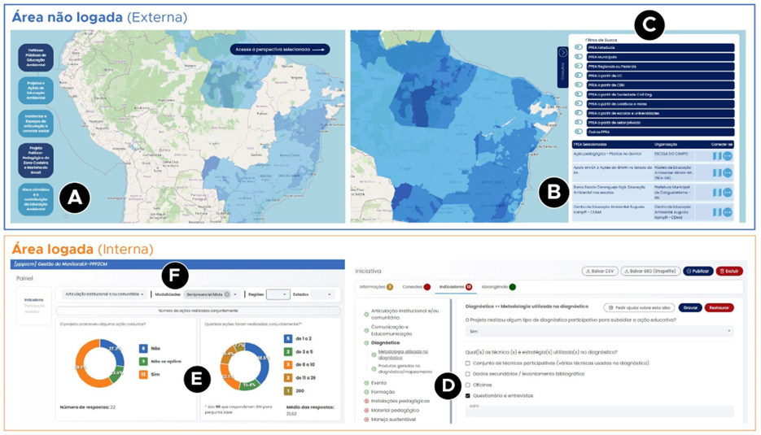

# Fluxos

## 📌 FLUXOS OPERACIONAIS E CASOS DE USO

### 👉 Casos Típicos de Uso

A Figura 9 ilustra os principais fluxos de interação do Sistema MonitoraEA, organizados entre a área pública (não logada) e o ambiente autenticado (logado), que correspondem a diferentes perfis e níveis de uso da plataforma.

Na área pública, acessível sem necessidade de autenticação, os usuários podem explorar mapas interativos que reúnem as iniciativas cadastradas, organizadas em cinco perspectivas de monitoramento e avaliação (M&A):

- Iniciativas governamentais de EA;
- Iniciativas não governamentais de EA;
- Iniciativas vinculadas à implementação do Projeto Político-Pedagógico da Zona Costeira e Marinha (PPPZCM);
- Colegiados de Políticas Públicas de EA;
- Centros de Educação e Cooperação Socioambiental.

**Figura 9 - Exemplos de funcionalidades da plataforma MonitoraEA (Oliveira, et al., 2025)**

Por meio dessa interface, é possível consultar informações detalhadas sobre cada ação, aplicar filtros temáticos e territoriais (Figura 9C) e solicitar participação em comunidades vinculadas (Figura 9B). Essas funcionalidades fortalecem a transparência e a articulação entre iniciativas de diferentes naturezas e regiões.

No ambiente autenticado, a plataforma amplia suas funcionalidades, permitindo o cadastro de iniciativas, a formação de redes colaborativas e o uso de instrumentos de autoavaliação baseados em critérios definidos coletivamente pelas comunidades de prática (Figura 9D). Usuários com perfil de gestão têm acesso a painéis de acompanhamento e análise (Figuras 9E – 9F), que consolidam informações e indicadores, apoiando o monitoramento, a avaliação e o planejamento estratégico das políticas e práticas de EA. O quadro 10 apresenta casos típicos de uso que sintetizam fluxos operacionais recorrentes no sistema.

**Quadro 10 – Matriz de funcionalidades por casos típicos de uso.**

| Caso                              | Ator principal                                                             | Objetivo                                                                                 | Funcionalidades utilizadas                                               | Produto / Resultado                                                             |
| --------------------------------- | -------------------------------------------------------------------------- | ---------------------------------------------------------------------------------------- | ------------------------------------------------------------------------ | ------------------------------------------------------------------------------- |
| Exploração pública de iniciativas | Público Geral (cidadão, estudante ou educador ambiental)                   | Consultar iniciativas de EA em determinado território                                    | Visualização pública; filtros geográficos e temáticos                    | Mapa interativo com registros e informações detalhadas sobre iniciativas        |
| Cadastro de nova iniciativa       | Educador ambiental instituição realizadora de iniciativas de EA            | Registrar uma iniciativa de EA com georreferenciamento de área de abrangência geográfica | Módulo de cadastro; vinculação a comunidades                             | Registro validado e publicado na base nacional                                  |
| Autoavaliação de iniciativas      | Comunidades formadas por instituições governamentais ou não governamentais | Avaliar práticas e políticas de EA sob sua responsabilidade                              | Módulo de autoavaliação; painel de indicadores; exportação de relatórios | Relatório automático de desempenho e indicadores de gestão (em desenvolvimento) |
| Diagnóstico territorial           | Articuladores locais, ANPPEA, Universidade, ONGs, OG-PNEA e colegiados     | Sistematizar e analisar dados sobre EA em determinado território                         | Dashboards e filtros analíticos; exportação de dados                     | Relatório territorial e mapa temático de iniciativas (em desenvolvimento)       |
| Análise e modelagem de redes [^1] | Equipe técnica, pesquisadores, gestores públicos, ANPPEA e OG-PNEA         | Mapear relações entre atores e instituições, identificando padrões de cooperação         | Módulo de análise e modelagem de redes (em projeto)                      | Protótipo de visualização de redes e relatório de conectividade territorial     |

[^1]: Em etapa de projeto no momento da publicação deste relatório.

### 👉 Fluxos Operacionais Detalhados

#### 👉 Fluxo de cadastro de iniciativas

O Fluxo de Cadastro de Iniciativas descreve o processo pelo qual atores responsáveis por ações de Educação Ambiental estruturam seu registro no MonitoraEA, desde o acesso inicial ao sistema até a submissão final para validação. O procedimento integra etapas de autenticação, definição da comunidade responsável, coleta de dados descritivos, georreferenciamento e revisão final, combinando interações do usuário com rotinas automatizadas de verificação e consolidação de informações para compor a base nacional de iniciativas.

#### 👉 Fluxo de Autoavaliação

O Fluxo de Autoavaliação corresponde ao detalhamento do passo 6 do quadro 11. Ele especifica as etapas pelas quais uma iniciativa de Educação Ambiental registra, analisa e organiza informações sobre seu próprio desempenho a partir dos instrumentos disponibilizados pelo MonitoraEA. O processo combina coleta estruturada de evidências, aplicação de critérios avaliativos, análise comparativa e geração de insumos para melhoria contínua, articulando tanto operações automatizadas do sistema quanto procedimentos ainda dependentes de execução manual pelas equipes responsáveis.

**Quadro 11 – Etapas do processo de cadastro de iniciativas.**

| Etapa                                                                                 | Objetivo                                                                                             | Ações do Usuário                                                                                          | Processamentos do Sistema                                                                                                    | Resultado                                                                  |
| ------------------------------------------------------------------------------------- | ---------------------------------------------------------------------------------------------------- | --------------------------------------------------------------------------------------------------------- | ---------------------------------------------------------------------------------------------------------------------------- | -------------------------------------------------------------------------- |
| **Passo 1 -** Acesso e Autenticação                                                   | Garantir entrada segura no sistema                                                                   | Acessa o portal; faz login ou cria conta                                                                  | Valida credenciais e permissões                                                                                              | Acesso autorizado à área autenticada                                       |
| **Passo 2 -** Seleção da Perspectiva de M&A                                           | Definir o modelo de cadastro adequado                                                                | Seleciona a perspectiva aplicável                                                                         | Carrega formulário específico; exibe instruções                                                                              | Formulário contextualizado habilitado                                      |
| **Passo 3 -** Criação da Comunidade                                                   | Definir o grupo responsável pelo acompanhamento da iniciativa                                        | Cria a comunidade vinculada à iniciativa; convida e aprova membros; define missão e regras internas       | Criação de entidade comunitária no banco; envio de convites; gestão de pedidos/ aprovações; atribuição inicial de permissões | Comunidade criada e vinculada (em estado pendente/ativa)                   |
| **Passo 4 -** Preenchimento de Dados Cadastrais                                       | Registrar informações gerais da iniciativa                                                           | Preenche dados básicos; escolhe categorias/tags; faz upload                                               | Validação automática de campos e formatos                                                                                    | Dados cadastrais completos e consistentes                                  |
| **Passo 5 -** Localização geográfica da área de abrangência                           | Registrar a localização ou área de atuação                                                           | Delimita área no WebGIS; confirma localização                                                             | Sobrepõe camadas; armazena coordenadas e metadados                                                                           | Feição geográfica registrada                                               |
| **Passo 6 -** Autoavaliação colaborativa por meio de indicadores                      | Registrar o desempenho da iniciativa com base nos indicadores definidos para cada Perspectiva de M&A | Preenche os indicadores; consulta orientações; revisa respostas; interage com outros membros para ajustes | Valida respostas; calcula as métricas de perfomance; gera sínteses automáticas; registra histórico de versões                | Autoavaliação registrada, consistente e vinculada à comunidade             |
| **Passo 7 -** Declaração da rede de conexões e parcerias                              | Mapear relações institucionais e operacionais relevantes à iniciativa                                | Declara instituições parceiras; classifica tipos de vínculo; descreve contribuições                       | Valida entidades; cruza dados com cadastros existentes; atualiza grafo de conexões[^2]                                       | Rede de parcerias registrada e integrada à estrutura relacional do sistema |
| **Passo 8 -** Informação de marcos e eventos relevantes à iniciativa (linha do tempo) | Registrar fatos estruturantes e eventos significativos ao longo da execução da iniciativa            | Inclui datas; descreve marcos; anexa imagens e links considerados úteis                                   | Armazena eventos; ordena cronologicamente; associa conteúdos à comunidade                                                    | Linha do tempo criada e vinculada ao histórico evolutivo da iniciativa     |
| **Passo 9 -** Revisão e Publicação                                                    | Finalizar e formalizar o cadastro                                                                    | Revisa dados e submete o registro                                                                         | Executa validações finais; gera número de registro                                                                           | Iniciativa registrada e confirmada pelo sistema[^3]                        |

[^2]: Em etapa de projeto no momento da publicação deste relatório.

[^3]: Está em etapa de desenho o protocolo para permitir que tais marcos e eventos possam ser disponibilizados, à critério dos membros da comunidade, à rede social, como uma postagem vinculada à iniciativa.

**Quadro 12 – Etapas do processo de autoavaliação.**

<table>
  <tr>
    <th>Etapa</th>
    <th>Objetivo</th>
    <th>Atividades Principais</th>
    <th>Produto / Resultado</th>
  </tr>
  <tr>
    <td><strong>Passo 1 - </strong> Acesso ao Módulo de Autoavaliação</td>
    <td>Iniciar o processo de avaliação da iniciativa</td>
    <td>
       <ul style="margin:0; padding-left:18px;">
         <li>Navegação até a iniciativa</li>
         <li>Acesso à aba de autoavaliação (indicadores)</li>
         <li>Compreensão do conjunto de indicadores e dinâmica de uso</li>
       </ul>
    </td>
    <td>Processo iniciado com compreensão dos critérios e escopo da avaliação</td>
  </tr>
  <tr>
    <td><strong>Passo 2 - </strong> Aplicação dos Instrumentos (indicadores)</td>
    <td>Registrar respostas e evidências para cada dimensão avaliada</td>
    <td>
       <ul style="margin:0; padding-left:18px;">
         <li>Respostas aos questionários;</li>
         <li>Registro de evidências e justificativas</li>
       </ul>
    </td>
    <td>Base de dados avaliada e evidências documentadas</td>
  </tr>
  <tr>
    <td><strong>Passo 3 - </strong> Análise de Resultados4</td>
    <td>Examinar o desempenho obtido e identificar padrões</td>
    <td>
       <ul style="margin:0; padding-left:18px;">
         <li>Visualização dos resultados parciais;</li>
         <li>Comparação histórica;</li>
         <li>Identificação de pontos fortes e melhorias</li>
       </ul>
    </td>
    <td>Diagnóstico preliminar do desempenho da iniciativa</td>
  </tr>
  <tr>
    <td><strong>Passo 4 - </strong> Elaboração de Plano de Ação5</td>
    <td>Estruturar ações de melhoria fundamentadas nos resultados</td>
    <td>
       <ul style="margin:0; padding-left:18px;">
         <li>Definição de ações prioritárias;</li>
         <li>Estabelecimento de prazos e responsáveis;</li>
         <li>Identificação de recursos necessários</li>
       </ul>
    </td>
    <td>Plano de ação estruturado, alinhado ao diagnóstico</td>
  </tr>
  <tr>
    <td><strong>Passo 5 - </strong> Compartilhamento e Discussão</td>
    <td>Promover validação coletiva e engajamento comunitário</td>
    <td>
       <ul style="margin:0; padding-left:18px;">
         <li>Compartilhamento dos resultados;</li>
         <li>Discussão colaborativa;</li>
         <li>Incorporação de contribuições externas</li>
       </ul>
    </td>
    <td>Avaliação consolidada e enriquecida pela colaboração</td>
  </tr>

</table>

#### 👉 Fluxo de Abrangência Geográfica

Este tópico apresenta o detalhamento do passo 5 do quadro 11. A definição da abrangência geográfica consiste na delimitação da área efetiva de atuação da iniciativa, assegurando que seu registro no sistema represente de forma fidedigna o território impactado. O processo inicia-se com a escolha ou construção do polígono que melhor expressa essa área, por meio de ferramentas WebGIS que permitem ao usuário desenhar diretamente no mapa, selecionar limites territoriais a partir de camadas de referência (como municípios, estados, biomas ou bacias hidrográficas) ou realizar o upload de arquivos espaciais contendo geometrias previamente elaboradas.

Após essa etapa, o sistema executa a verificação técnica das geometrias, assegurando consistência topológica e compatibilidade com os padrões espaciais adotados pela plataforma. Quando múltiplos polígonos são fornecidos, o sistema aplica procedimentos automáticos de merge para consolidá-los em uma única geometria de referência. Concluídas essas validações, o usuário confirma o resultado e a abrangência geográfica é registrada de forma definitiva como parte do cadastro da iniciativa.

#### 👉 Fluxo de Identificação de conexões e parcerias

Este tópico apresenta o detalhamento do passo 7 do quadro 11. O Fluxo de Identificação de Conexões e Parcerias descreve o processo pelo qual o responsável pela iniciativa declara vínculos institucionais e relacionais relevantes, incluindo conexões com políticas públicas, apoios recebidos de outras instituições e apoios oferecidos a outras iniciativas. O procedimento combina a seleção de opções pré-definidas, a indicação ordenada dos atores envolvidos e a classificação da natureza das relações, permitindo ao sistema estruturar redes de cooperação e dependência institucional para análise posterior.

O fluxo inicia-se com a verificação de eventuais conexões da iniciativa com políticas públicas de Educação Ambiental, onde o usuário seleciona se há relação direta e, em caso positivo, identifica até cinco políticas em ordem de relevância, classificando cada vínculo conforme sua natureza. Em seguida, o usuário informa se a iniciativa recebe apoio de outras instituições, selecionando “sim” ou “não” e, quando aplicável, listando as organizações envolvidas também em ordem de relevância, incluindo para cada uma o tipo de relação estabelecida.

O terceiro passo corresponde à identificação das situações em que a iniciativa apoia ou presta algum tipo de suporte a outras ações ou projetos. Assim como nas etapas anteriores, o usuário indica se existe esse vínculo e, quando existente, descreve até cinco iniciativas apoiadas, especificando a natureza de cada relação. Durante todo o fluxo, o sistema realiza validações básicas, garante a consistência dos dados preenchidos, e armazena as relações declaradas em modelo estruturado, integrando-as automaticamente aos módulos analíticos e de rede.

#### 👉 Fluxo de mapeamento de marcos e eventos do ciclo de vida da iniciativa (linha do tempo)

Este tópico apresenta o detalhamento do passo 8 do quadro 11. O Fluxo de Mapeamento de Marcos e Eventos (linha do tempo) organiza o processo pelo qual o responsável pela iniciativa registra, de forma estruturada, acontecimentos relevantes ao longo do ciclo de vida da ação. A ferramenta permite inserir eventos marcados por mês e ano, relacionar imagens ilustrativas e textos descritivos, garantindo sua apresentação automática em ordem cronológica. A funcionalidade apoia tanto a documentação histórica da iniciativa quanto análises temporais de engajamento, evolução institucional e implementação das atividades.

O fluxo inicia-se com a apresentação da interface de Linha do Tempo, acompanhada de orientações gerais sobre seu uso e exemplos de marcos relevantes, como criação da iniciativa, eventos públicos, oficinas, reuniões estratégicas, publicações e materiais produzidos. O usuário seleciona o mês e ano do marco que deseja registrar e, em seguida, pode adicionar uma imagem ilustrativa (fotografia, ícone ou figura representativa) utilizando o componente de upload exibido na tela.

Após a seleção da imagem, o usuário insere um texto descritivo do evento, que será exibido como anotação associada ao marcador temporal. Cada novo marco pode ser adicionado por meio do botão específico, sendo automaticamente posicionado na linha do tempo conforme sua data. A interface permite ainda editar ou excluir registros previamente inseridos, preservando a consistência dos dados apresentados.

Durante o processo, o sistema executa validações básicas, como verificação de preenchimento mínimo, ordenação cronológica automática e vinculação dos arquivos de imagem ao identificador único de cada evento. Ao final, os marcos são salvos como parte permanente do cadastro da iniciativa.

[^4]: Processo ainda não automatizado. Em etapa de projeto no momento da publicação deste relatório técnico.

[^5]: Processo ainda não automatizado. Em etapa de projeto no momento da publicação deste relatório técnico.
