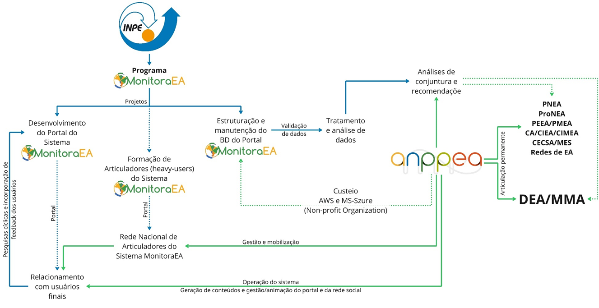

# Governança

## 📌 GOVERNANÇA, GESTÃO E SUSTENTABILIDADE

### 👉 Modelo de Governança

A governança do Sistema MonitoraEA está organizada em uma arquitetura colaborativa e multinível, que articula instituições com competências complementares e alinhadas à Política Nacional de Educação Ambiental (PNEA). A estrutura integra dimensões técnico-científicas, sociais e interinstitucionais, garantindo robustez tecnológica, legitimidade social e aderência às políticas públicas de Educação Ambiental.

O arranjo de desenvolvimento tecnológico é liderado pelo Programa MonitoraEA (Processo SEI/INPE n.º 01340.009497/2022-57), programa do portfólio institucional do Instituto Nacional de Pesquisas Espaciais (INPE), realizado por meio do Laboratório de Análise e Desenvolvimento de Indicadores de Sustentabilidade (LADIS), alocado na Coordenação de Ciência do Sistema Terrestre (CCST), sob responsabilidade do Dr. Evandro Albiach Branco. O Programa atua como núcleo técnico-científico responsável pelo desenvolvimento, manutenção e evolução da infraestrutura tecnológica do sistema, a partir da qual são estruturados e geridos os projetos que implementam novas funcionalidades, melhorias e complementos do portal. Ainda, faz parte das atividades estruturais do programa, os processos de construção participativa de indicadores que suportam as diversas perspectivas do sistema.

Nessa configuração, o INPE, por meio do Programa MonitoraEA, coordena quatro frentes centrais:

- Desenvolvimento do Portal MonitoraEA, abrangendo concepção, codificação, testes e aprimoramento contínuo da plataforma digital;
- Os processos de formação de articuladores locais (heavy users), por meio da capacitação e suporte à Rede Nacional de Articuladores do Sistema;
- Estruturação e manutenção da infraestrutura de dados, assegurando armazenamento, segurança, atualização e interoperabilidade, com custeio viabilizado por parcerias com provedores de nuvem (AWS e Microsoft Azure), firmadas via ANPPEA;
- A coordenação de processos metodológicos estruturados para a construção participativa de indicadores de M&A para as diversas perspectivas do Sistema MonitoraEA.

A Articulação Nacional de Políticas Públicas em Educação Ambiental (ANPPEA) é corresponsável pela operação, gestão social do sistema e advocacy em políticas públicas de EA, atuando diretamente na mobilização da rede de usuários, na curadoria de conteúdos e na gestão das comunidades finalísticas. Também assegura a legitimidade social do MonitoraEA por meio de processos contínuos de validação, engajamento, coleta de feedbacks e interação direta com os usuários e articulação com instituições do campo da EA em todo o Brasil.

Em nível estratégico, o Departamento de Educação Ambiental do Ministério do Meio Ambiente (DEA/MMA) exerce função de apoio à articulação interinstitucional, contribuindo para o alinhamento do Sistema MonitoraEA aos instrumentos, colegiados e redes vinculadas à PNEA. O DEA/MMA atua como instância pública de referência, facilitando processos de relacionamento institucional, promovendo a integração do sistema com políticas federais, e interfederativas ou subnacionais, e redes governamentais e estimulando sua adoção por órgãos e entidades públicas. Além disso, utiliza os dados produzidos pelo sistema para subsidiar ações e decisões orientadas por evidências no âmbito da implementação da PNEA.

A seguir, apresenta-se o quadro 13, que consolida as competências e responsabilidades de cada instituição envolvida, formalizando o arranjo de governança do Sistema MonitoraEA.

**Quadro 13 – Componentes da Governança do Sistema MonitoraEA.**

<table>
  <tr>
    <th>Componente da estrutura de Governança</th>
    <th>Descrição Geral</th>
    <th>Competências e Responsabilidades</th>
  </tr>

  <tr>
    <td rowspan="6">Coordenação Técnica e Científica: <strong>INPE/LADIS</strong></td>
    <td rowspan="6">
      Desenvolvimento tecnológico da plataforma (concepção, codificação, testes, aprimoramentos)
    </td>
    <td>Interfaces públicas e autenticadas</td>
  </tr>

  <tr>
    <td>Gestão de repositórios e documentação técnica</td>
  </tr>

  <tr>
    <td>Manutenção da infraestrutura (servidores, bancos de dados, nuvem)</td>
  </tr>

  <tr>
    <td>Segurança da informação e proteção de dados</td>
  </tr>

  <tr>
    <td>Pesquisa e inovação em métodos, algoritmos e funcionalidades</td>
  </tr>
  <tr>
    <td>Estruturação e manutenção do banco de dados e de sua interoperabilidade</td>
  </tr>

  <tr>
    <td rowspan="6">Gestão Social, Mobilização e Advocacy: <strong>ANPPEA</strong></td>
    <td rowspan="6">
      Instância corresponsável pela operação social, mobilização de usuários e gestão comunitária.
    </td>
    <td>Articulação da Rede Nacional de Articuladores Locais </td>
  </tr>

  <tr>
    <td>Curadoria e gestão de conteúdos do portal e da rede social</td>
  </tr>

  <tr>
    <td>Gestão das comunidades finalísticas e mediação</td>
  </tr>

  <tr>
    <td>Relacionamento contínuo com usuários (engajamento, suporte, feedbacks)</td>
  </tr>

  <tr>
    <td>Validação social das informações produzidas</td>
  </tr>

  <tr>
    <td>Suporte institucional para parcerias e custeio da infraestrutura em nuvem</td>
  </tr>

  <tr>
    <td rowspan="6">Apoio à Articulação Interinstitucional: <strong>DEA/MMA</strong></td>
    <td rowspan="6">
      Órgão federal responsável por apoiar processos de relacionamento interinstitucional e alinhamento do sistema à PNEA.
    </td>
    <td>Facilitação da articulação com políticas, instrumentos e colegiados da PNEA (ProNEA, PEEA, CIEA, CECSA, etc.)</td>
  </tr>

  <tr>
    <td>Apoio à definição de orientações estratégicas para uso governamental do sistema</td>
  </tr>

  <tr>
    <td>Promoção da integração e adoção do sistema por órgãos públicos</td>
  </tr>

  <tr>
    <td> Utilização de dados para subsidiar políticas orientadas por evidências</td>
  </tr>

</table>

A figura 10 apresenta esta estrutura de organização do modelo de governança.

**Figura 10 – Estrutura do modelo de governança do Sistema MonitoraEA.**

### 👉 Mecanismos de Articulação

Os mecanismos de articulação do sistema estruturam a interação entre os atores institucionais responsáveis pelo desenvolvimento, pela gestão e pela retroalimentação contínua do MonitoraEA. A articulação ocorre por meio de instâncias formais e de canais de participação que asseguram coerência técnica, legitimidade institucional e alinhamento às necessidades da comunidade de prática.

O Comitê Gestor do Sistema, composto pelo INPE e pela ANPPEA, constitui a instância central de governança do MonitoraEA. Cabe a ele definir prioridades, pactuar cronogramas, validar diretrizes de desenvolvimento, aprovar planos de trabalho e acompanhar a execução geral do sistema. Sua atuação ocorre por meio de reuniões trimestrais, com possibilidade de convocações extraordinárias sempre que necessário para deliberar sobre temas urgentes ou estratégicos.

Complementarmente, o Fórum de Articuladores Locais funciona como espaço consultivo e colaborativo dedicado à retroalimentação contínua do sistema. Integrado pela Rede de Articuladores Locais vinculados à ANPPEA, o fórum reúne percepções de uso territorial, desafios operacionais, necessidades emergentes e contribuições fundamentais para aprimoramentos de conteúdo e de experiência do usuário. Seus encontros são realizados periodicamente, acompanhando o ciclo de mobilização e acompanhamento conduzido pela ANPPEA.

**Quadro 14 – Matriz de tomada de decisão do Sistema MonitoraEA.**

| Tipo de Decisão       | Competência / Responsabilidade                    | Atores Envolvidos                                          | Periodicidade / Dinâmica                                                   |
| --------------------- | ------------------------------------------------- | ---------------------------------------------------------- | -------------------------------------------------------------------------- |
| Decisões Técnicas     | Competência primária do INPE                      | Equipes técnicas vinculadas ao INPE                        | Processo contínuo; acionamento conforme demandas técnicas                  |
| Decisões de Conteúdo  | Competência da ANPPEA                             | Gestores e equipes responsáveis por conteúdos e diretrizes | Definidas por ciclos de atualização ou demandas institucionais             |
| Decisões Estratégicas | Competência conjunta entre INPE, ANPPEA e DEA/MMA | Representantes das três instituições                       | Tratadas em reuniões bilaterais ou trilaterais, conforme pauta estratégica |

### 👉 Fluxos de Operação e Articulação

O ciclo operacional do Sistema MonitoraEA é estruturado como um conjunto de processos interdependentes que articulam produção de dados pelos usuários, mediação social pela rede de Articuladores Locais, curadoria e validação realizadas pela ANPPEA, e mecanismos institucionais de análise e retroalimentação técnica. Esse ciclo combina etapas já implementadas na plataforma com funções previstas para as fases subsequentes de evolução do sistema, permitindo que a governança opere de forma progressiva, escalável e orientada a dados. A matriz a seguir sintetiza os componentes centrais desse fluxo, seus responsáveis e o estágio atual de implementação.

**Quadro 15 – Matriz de operação do Sistema MonitoraEA.**

| Etapa                                   | Descrição Técnica                                                  | Responsáveis                  | Status                           |
| --------------------------------------- | ------------------------------------------------------------------ | ----------------------------- | -------------------------------- |
| Geração Descentralizada de Dados        | Inserção contínua de iniciativas, autoavaliações e documentos      | Usuários                      | Implementada                     |
| Mobilização Territorial e institucional | Formação, suporte e engajamento da base usuária                    | ANPPEA + Articuladores Locais | Em etapa piloto de implementação |
| Validação Colaborativa                  | Verificação de consistência, legitimidade e adequação              | ANPPEA + Articuladores Locais | Não implementada                 |
| Análise e Síntese Institucional         | Produção de análises, relatórios e recomendações                   | INPE + ANPPEA + DEA/MMA       | Não implementada                 |
| Retroalimentação Técnica                | Evolução tecnológica baseada em feedback e análises institucionais | INPE                          | Não implementada                 |

### 👉 Mecanismos de Retroalimentação

A retroalimentação do Sistema MonitoraEA é estruturada como um processo contínuo de captação, análise e conversão de percepções dos usuários em melhorias técnicas e metodológicas. Esses mecanismos operam em ciclos, combinando instrumentos de coleta estruturada, análises de uso e participação, escutas qualificadas e processos formais de priorização. O objetivo é garantir que a plataforma evolua de forma responsiva, transparente e alinhada às necessidades reais da comunidade usuária e das instituições que compõem o sistema.

**Quadro 16 – Matriz de retroalimentação do Sistema MonitoraEA.**

| Componente               | Descrição                                                                | Responsáveis            | Finalidade                                                                 | Status de Implementação               |
| ------------------------ | ------------------------------------------------------------------------ | ----------------------- | -------------------------------------------------------------------------- | ------------------------------------- |
| Formulários Estruturados | Coleta sistemática de sugestões, críticas e relatos de uso               | INPE                    | Registrar demandas e dificuldades operacionais                             | Em processo de definição do protocolo |
| Análise de Métricas      | Monitoramento de engajamento, desempenho e padrões de navegação          | INPE                    | Identificar gargalos técnicos e oportunidades de otimização                | Implementado parcialmente             |
| Pesquisas Periódicas     | Avaliações regulares sobre usabilidade, aderência e satisfação           | INPE                    | Medir percepção dos usuários e priorizar melhorias                         | Em processo de definição do protocolo |
| Grupos Focais            | Discussões aprofundadas com usuários estratégicos e Articuladores Locais | ANPPEA                  | Produzir escuta qualificada para decisões de conteúdo                      | Em processo de definição do protocolo |
| Ciclos de Revisão        | Análise periódica de processos e resultados gerados pelo sistema         | INPE / ANPPEA           | Ajustar metodologias e fluxos operacionais                                 | Implementado parcialmente             |
| Priorização Coletiva     | Definição participativa de demandas e inovações                          | ANPPEA / INPE / DEA-MMA | Garantir alinhamento entre necessidades de usuários e capacidades técnicas | Implementado parcialmente             |
| Implementação Iterativa  | Desenvolvimento incremental baseado em feedbacks e validações            | INPE                    | Atualizar funcionalidades e corrigir problemas                             | Implementado parcialmente             |

### 👉 Sustentabilidade Institucional e Operacional

A sustentabilidade do Sistema MonitoraEA baseia-se em três eixos complementares:

- Sustentabilidade técnica, garantida pela infraestrutura de aplicações e dados, pelo repositório de código versionado e pelos processos contínuos de atualização e segurança mantidos pelo INPE.
- Sustentabilidade social, ancorada na ANPPEA, que promove a apropriação coletiva, a formação de novos usuários e a disseminação dos resultados.
- Sustentabilidade política e institucional, consolidada pela articulação permanente com o DEA/MMA e os atores da rede de implementação da PNEA, assegurando coerência com as políticas públicas e continuidade de apoio governamental.
