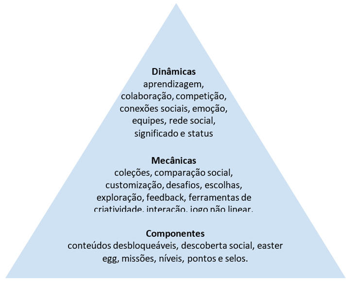
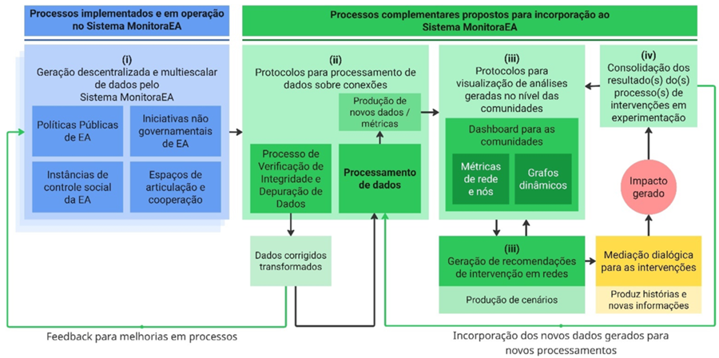
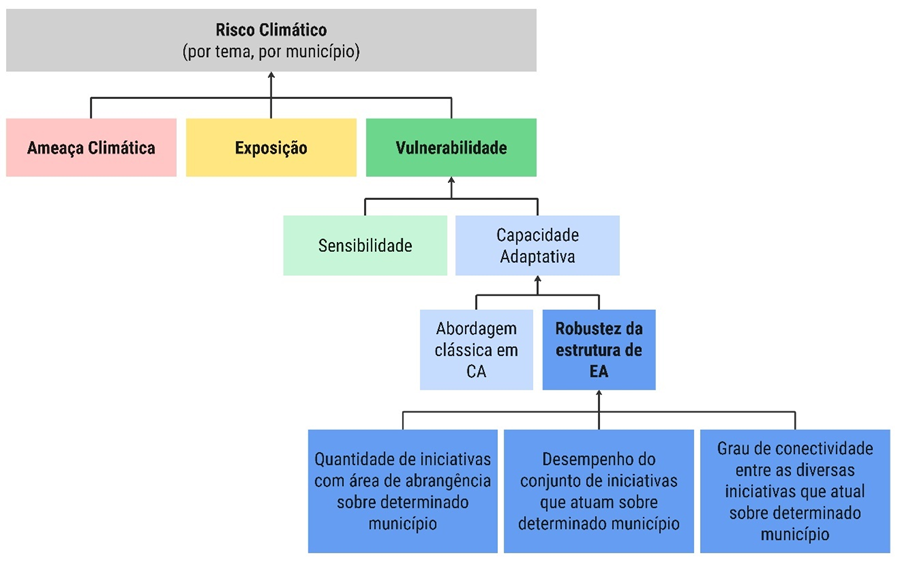

# Roadmap

## 📌 ROADMAP TÉCNICO (2026–2030)

A evolução tecnológica do Sistema MonitoraEA segue um plano contínuo de consolidação, ampliação funcional e incorporação progressiva de capacidades analíticas e operacionais. O roadmap técnico organiza essa trajetória em eixos estruturantes que orientam as etapas de desenvolvimento, os módulos prioritários e as iniciativas previstas para o período 2025–2030.

A infraestrutura atual encontra-se estabilizada como plataforma unificada, resultado da reengenharia conduzida entre meados de 2024 e 2025, que consolidou arquitetura, banco de dados, modelo de integração, padrões de usabilidade e governança técnica. A partir dessa base, o roadmap prevê a ampliação de funcionalidades, a maturação de módulos estratégicos e a incorporação de tecnologias avançadas voltadas à interoperabilidade, análise territorial, governança distribuída e qualificação dos processos de M&A em Educação Ambiental.

### 👉 Protocolo de Gamificação e Engajamento

O Protocolo de Gamificação constitui um dos produtos centrais do projeto Desenvolvimento de Estudos, Protocolos e Planos para o Incremento do Programa MonitoraEA, executado no âmbito do INPE, sob coordenação do Dr. Evandro Albiach Branco (CNPq nº 422851/2025-6), com apoio do DEA/MMA e bolsa CNPq (processo nº 383071/2025-9). Seu objetivo é orientar o desenvolvimento de ferramentas destinadas a aumentar e sustentar o engajamento dos usuários do Sistema MonitoraEA, aplicando princípios de gamificação, isto é, o uso de elementos de design de jogos em contextos não lúdicos, conforme a literatura especializada (Werbach & Hunter, 2012; 2015; Mauroner, 2019; Tondello et al., 2016).

Assim, o Protocolo de Gamificação do Sistema MonitoraEA constitui uma camada funcional voltada ao estímulo da participação qualificada, ao fortalecimento das comunidades e redes de prática e ao incremento da regularidade e diversidade de contribuições ao sistema. Esta funcionalidade integra a arquitetura sociotécnica geral descrita no Capítulo 3 e está alinhada aos princípios de participação, colaboração, descentralização e aprendizado social estabelecidos na Seção 5.

Previsto para implementação em 2026, o módulo será integrado às comunidades, às autoavaliações das diferentes Perspectivas de M&A e aos fluxos de dados do sistema, atuando como mecanismo estruturante para ampliar a vitalidade colaborativa do MonitoraEA.

#### 👉 Objetivos de gamificação

Os objetivos foram definidos por meio de um grupo focal composto por desenvolvedores, gestores do portal, facilitadores do PPPZCM, conselheiros da ANPPEA e equipe do projeto. As contribuições foram sistematizadas no Quadro 22, abrangendo cinco eixos:

- Melhoria da plataforma: categorização e análise de iniciativas, melhoria de interface e estímulo ao uso contínuo.
- Engajamento e formação: incentivo à participação em processos formativos e nas atividades de mapeamento, avaliação e monitoramento.
- Redes de colaboração: fortalecimento das interações e cooperações territoriais.
- Visibilidade e valorização: reconhecimento de boas práticas e experiências em EA.
- Missões e cultura de M&A: estímulo à práxis da EA e ao uso orgânico de ferramentas de monitoramento.

Esses objetivos servem como parâmetros para todas as etapas posteriores do protocolo.

**Quadro 22 - Objetivos de gamificação do Sistema MonitoraEA**

<table>
  <tr>
    <th>Tema</th>
    <th>Objetivos</th>
  </tr>

  <tr>
    <td rowspan="2">Melhoria da plataforma (interface, acessibilidade e usabilidade)</td>
    <td>Proporcionar à Plataforma MonitoraEA formas de análise e categorização das iniciativas com base em critérios de localização geográfica, categoria do promotor (setor público, setor privado ou sociedade civil organizada) e temática central (mudança do clima, água ou biodiversidade).</td>
  </tr>
  <tr>
    <td>Oferecer recursos que estimulem o uso contínuo e progressivo da Plataforma MonitoraEA, com a incorporação de dispositivos facilitadores de acesso.</td>
  </tr>

  <tr>
    <td>Engajamento e formação de usuários </td>
    <td>Estimular a participação ativa e contínua da comunidade do Sistema MonitoraEA nos processos formativos e nos processos de mapeamento, avaliação e monitoramento das iniciativas de educação ambiental.</td>
  </tr>
  <tr>
    <td>Redes de colaboração e cooperação</td>
    <td>Promover o fortalecimento das redes de colaboração e cooperação entre territórios, comunidades e atores do Sistema MonitoraEA.</td>
  </tr>
  <tr>
    <td>Visibilidade e valorização das ações </td>
    <td>Desenvolver recursos que destaquem os indivíduos e as instituições que fazem parte da comunidade do Sistema MonitoraEA, sobre os quais são reconhecidas as boas práticas, as experiências exitosas e as lições aprendidas em educação ambiental.</td>
  </tr>
  <tr>
    <td>Missões, ciência cidadã e experimentação</td>
    <td>Oferecer recursos que possibilitem à comunidade do Sistema MonitoraEA desenvolver a práxis da educação ambiental por meio de atividades de articulação entre teoria e prática.</td>
  </tr>
  <tr>
    <td>Autoavaliação e acompanhamento</td>
    <td>Oferecer recursos para a comunidade do Sistema MonitoraEA desenvolverem de forma orgânica e espontânea a cultura de monitoramento e avaliação das iniciativas de educação ambiental.</td>
  </tr>

 </table>

#### 👉 Comportamentos-alvo e métricas

A segunda etapa identifica comportamentos essenciais para gerar valor público no Sistema MonitoraEA, acompanhados de suas métricas de monitoramento (Quadro 23). Abrangem desde ações iniciais, como criar uma conta e cadastrar iniciativas, até atividades avançadas, como participar de grupos de trabalho, publicar conteúdos, colaborar em iniciativas, baixar dados, realizar consultas, participar de eventos, elaborar planos de ação e apoiar o sistema. Essas métricas estruturam o acompanhamento contínuo do engajamento da comunidade.

**Quadro 23 - Relação dos comportamentos alvos identificados e suas métricas de acompanhamento**

<table>
  <tr>
    <th>Comportamentos Alvos Gerais</th>
    <th>Métricas</th>
  </tr>

  <tr>
    <td>Criar uma conta no portal</td>
    <td>Número de usuários cadastrados</td>
  </tr>

  <tr>
    <td>Cadastrar iniciativas de educação ambiental</td>
    <td>Número de iniciativas cadastradas</td>
  </tr>
  <tr>
    <td>Concluir cadastro de iniciativas de educação ambiental</td>
    <td>Percentual de cadastro efetuado</td>
  </tr>
  <tr>
    <td>Se inscrever em processos formativos</td>
    <td>Número de inscritos</td>
  </tr>
  <tr>
    <td>Concluir processos formativos</td>
    <td>Número de concluintes</td>
  </tr>
  <tr>
    <td>Se tornar articulador(a) do Sistema MonitoraEA</td>
    <td>Número de articuladores</td>
  </tr>
  <tr>
    <td>Atualizar informações das iniciativas cadastradas</td>
    <td>Percentual de atualização</td>
  </tr>
  <tr>
    <td>Criar um grupo de trabalho</td>
    <td>Número de grupo de trabalho criado</td>
  </tr>
  <tr>
    <td>Participar de um ou mais grupo(s) de trabalho</td>
    <td>Número de grupos de trabalho por usuário</td>
  </tr>
  <tr>
    <td>Seguir um ou mais grupos de trabalho(s)</td>
    <td>Número de grupos de trabalho seguidos</td>
  </tr>
  <tr>
    <td>Postar conteúdos no(s) grupo(s) de trabalho</td>
    <td>Número de postagens nos grupos de trabalho</td>
  </tr>
  <tr>
    <td>Baixar bases de dados</td>
    <td>Número de bases de dados baixadas</td>
  </tr>
  <tr>
    <td>Fazer consultas</td>
    <td>Número de consultas realizadas</td>
  </tr>
  <tr>
    <td>Participar dos eventos</td>
    <td>Número de participantes em eventos</td>
  </tr>
  <tr>
    <td>Apoiar o Sistema MonitoraEA</td>
    <td>Número de apoiadores</td>
  </tr>
  <tr>
    <td>Contribuir com o aprimoramento do Sistema MonitoraEA</td>
    <td>Número de sugestões/comentários</td>
  </tr>
  <tr>
    <td>Postar conteúdos no feed</td>
    <td>Número de postagens no feed</td>
  </tr>
  <tr>
    <td>Visitar o portal MonitoraEA</td>
    <td>Número de acessos ao portal</td>
  </tr>
  <tr>
    <td>Baixar relatórios</td>
    <td>Número de relatórios baixados</td>
  </tr>
  <tr>
    <td>Compartilhar conteúdos das iniciativas</td>
    <td>Número de compartilhamentos</td>
  </tr>
  <tr>
    <td>Fazer o curso de articuladores do Sistema MonitoraEA</td>
    <td>Frequência mínima alcançada</td>
  </tr>
  <tr>
    <td>Elaborar plano de ação de articulação</td>
    <td>Número de planos de ação elaborados</td>
  </tr>

</table>

#### 👉 Perfis de usuários

A análise das personas, baseada no relatório de avaliação heurística da plataforma (Oliveira, 2025), foi reinterpretada segundo os arquétipos de Bartle (1996) e Marczewski (2015), a fim de permitir um design compatível com múltiplos subgrupos de usuários. A aderência identificada indica predominância de socializers (19,46%) e explorers/free spirits (17,98%), seguidos de philanthropists (12,92%), players (11,15%) e achievers (9,52%). Cerca de 18% das variáveis não apresentaram aderência e 11% mostraram antagonismo. Os arquétipos killers e disrupters não se aplicaram a nenhum padrão observado. O Quadro 24 sintetiza esse mapeamento.

**Quadro 24 - Síntese da avaliação das variáveis das personas em relação aos arquétipos clássicos**

<table>
  <tr>
    <th>Bartle (1996)</th>
    <th rowspan="2">Achievers</th>
    <th>Explorers</th>
    <th rowspan="2">Killers</th>
    <th rowspan="2">Socializers</th>
    <th rowspan="2">Disrupters</th>
    <th rowspan="2">Philanthropist</th>
    <th rowspan="2">Players</th>
    <th rowspan="2">Nenhum</th>
    <th rowspan="2">Antagonia</th>
  </tr>
  <tr>
    <th>Marckewski (2015)</th>
    <th>Free Spirits</th>
  </tr>

  <tr>
    <td rowspan="4">Descrição dos Arquétipos</td>
    <td>Ser competente, sempre buscar aprender coisas novas e superar desafios</td>
    <td>Ter autonomia, se expressar e explorar as possibilidades de construir coisas novas</td>
    <td>Estar sempre no primeiro lugar, derrotando adversários.</td>
    <td>Se relacionar, interagir com os outros e construir conexões.</td>
    <td>Causar disrupturas e mudar as coisas, em especial, mudar as regras.</td>
    <td>Ter um propósito e ajudar os outros sem esperar nada em troca.</td>
    <td>Ser recompensado(a), apreciando todos os benefícios por seu comportamento.</td>
    <td rowspan="4">Variável não demonstrou aderência para algum arquétipo</td>
    <td rowspan="4">Variável demonstrou antagonismo a um ou mais arquétipos</td>
  </tr>
  <tr>
    <td>Sentir a adrenalina de subir de nível ou ganhar alguma coisa</td>
    <td>Encontrar novos conteúdos</td>
    <td>Impor sua vontade.</td>
    <td>Se envolver com amigos.</td>
    <td>Perturbar o sistema.</td>
    <td>Contribuir com comunidade.</td>
    <td>Ganhar algo.</td>
  </tr>
  <tr>
    <td>Perfeccionismo</td>
    <td>Independência</td>
    <td>Dominância</td>
    <td>Extroversão</td>
    <td>Ruptura</td>
    <td>Altruísmo</td>
    <td>Gratificação</td>
  </tr>
  <tr>
    <td>Ganhar pontos e acumular medalhas</td>
    <td>Descobrir todas as possibilidades de jogo e encontrar tesouros escondidos.</td>
    <td>Derrotar os outros jogadores.</td>
    <td>Se relacionar com os outros jogadores.</td>
    <td>Mudar as regras do jogo.</td>
    <td>Ajudar os outros a jogarem.</td>
    <td>Receber o seu prêmio.</td>
  </tr>

  <tr>
    <td>Aderência das Variáveis</td>
    <td>9,52%</td>
    <td>17,98%</td>
    <td>0,00%</td>
    <td>19,46%</td>
    <td>0,00%</td>
    <td>12,92%</td>
    <td>11,15%</td>
    <td>17,68%</td>
    <td>11,29%</td>
  </tr>

</table>

#### 👉 Ciclos de engajamento e progressão

A quarta etapa organiza o design em ciclos de engajamento (nível micro) e etapas de progressão (nível macro), considerando os processos estruturantes do MonitoraEA: formação, adesão à rede social, atuação dos articuladores e ciclo de M&A das iniciativas. O Quadro 25 apresenta as variáveis utilizadas para modelar cada ciclo, incluindo motivação, escolhas significativas, estrutura e conflitos potenciais. A proposta segue o princípio de que o êxito do design depende da coerência entre comportamentos-alvo, motivações, possibilidades de ação, infraestrutura do sistema e mitigação de barreiras (Werbach & Hunter, 2012).

**Quadro 25 – Variáveis de análise dos ciclos de engajamento**

<table>
    <tr>
        <th>Atividade</th>
        <th>Motivação</th>
        <th>Escolhas Significativas</th>
        <th>Estrutura</th>
        <th>Conflitos Potenciais</th>
   </tr>
   <tr>
        <td>Comportamentos alvo específicos de cada ciclo de engajamento</td>
        <td>Levantamento da motivação que leva o usuário a executar o comportamento alvo e/ou outros comportamentos associados</td>
        <td>Possibilidades de ação que os usuários têm no sistema e que influenciam executar (ou não) o comportamento alvo</td>
        <td>Mecanismos do sistema que permitem rastrear e medir as métricas de acompanhamento dos comportamentos alvo</td>
        <td>Identificação de situações, barreiras ou resultados que descaracterizam, prejudicam ou interrompem a realização dos comportamentos alvo</td>
   </tr>
</table>

O Quadro 26 sintetiza ainda a associação entre etapas de progresso (níveis) e estratégias de gamificação (componentes) para cada ciclo — como barras de progresso, avatares, páginas de perfil, selos, certificados, conteúdos desbloqueáveis, mapas, recomendações, dashboards e outros elementos que estruturam a jornada do usuário no sistema.

**Quadro 26 — Síntese das Etapas de Progresso (Níveis) e Estratégias de Gamificação (Componentes)**

<table>
    <tr>
        <th>Processos Formativos</th>
        <th>Portal e Rede Social MonitoraEA</th>
        <th>Articuladores MonitoraEA</th>
        <th>M&A de Iniciativas</th>
   </tr>

   <tr>
        <td><strong>Passo 1</strong> Se inscrever em processos formativos a) Página de informações b) Página de perfil</td>
        <td>Cadastrar perfil no MonitoraEA:  a) Página de perfil  b) Avatar; c) Tutoriais </td>
        <td>Assinar Termo de Adesão</td>
        <td>Cadastrar iniciativa:  a) Avatar; b) Guia de Tomada de Decisão; c) Barra de progresso; d) Identificadores</td>
   </tr>
   <tr>
        <td><strong>Passo 2</strong> Participar dos processos formativos a) Avatar b) Barra de progresso c) Serious Game</td>
        <td>Aderir à rede social</td>
        <td>Participar da Rede de Articuladores:  a) Página exclusiva (foto e contato)</td>
        <td>Publicar iniciativa:  a) Selo; b) Mapa</td>
   </tr>
   <tr>
        <td><strong>Passo 3</strong> Concluir e se certificar a) Selos e certificados</td>
        <td>Publicar conteúdos alinhados aos objetivos do MonitoraEA:  a) Tags temáticas</td>
        <td>3) Acessar área de gestão:  a) Área de trabalho; b) Dashboard</td>
        <td>Colaborar com iniciativa:  a) Recomendação de perfis; b) Recomendação de iniciativas</td>
   </tr>
   <tr>
        <td></td>
        <td>Receber recomendações de perfis, GTs e/ou iniciativas:  a) Selos e certificados; b) Leaderboard interno</td>
        <td>Elaborar plano de trabalho</td>
        <td>Monitoramento e avaliação:  a) Dashboard</td>
   </tr>
   <tr>
        <td></td>
        <td></td>
        <td>Participar de processos formativos:  a) Selos e certificados</td>
        <td></td>
   </tr>
  
</table>

#### 👉 Elementos de gamificação

A seleção dos elementos específicos se baseia na literatura e nos arquétipos predominantes entre as personas (Campos Jr. et al. 2024; Fernandes & Aquino Jr., 2016; Klock et al., 2020; Mauroner, 2019; Tondello et al., 2016). O Quadro 27 apresenta a matriz de recorrência entre elementos (pontos, níveis, desafios, recompensas, coleções, colaboração, missões, criatividade, etc.) e os arquétipos correspondentes (explorer, free spirit, socialiser). Esses elementos são organizados segundo o framework de dinâmicas, mecânicas e componentes, conforme a Figura 11, que estabelece o quadro referencial adotado pelo protocolo de gamificação do Sistema MonitoraEA.

**Quadro 27 – Matriz de recorrência entre elementos de gamificação e arquétipos**

<table>
  <tr>
    <th>Elementos de Gamificação</th>
    <th>explorer</th>
    <th>free spirit</th>
    <th>socialiser</th>
  </tr>
  <tr>
    <td>aprendizagem</td>
    <td>1</td>
    <td>1</td>
    <td>1</td>
  </tr>
  <tr>
    <td>colaboração</td>
    <td>1</td>
    <td>1</td>
    <td>2</td>
  </tr>
  <tr>
    <td>coleções</td>
    <td>1</td>
    <td>1</td>
    <td>1</td>
  </tr>
  <tr>
    <td>comparação social</td>
    <td>2</td>
    <td>1</td>
    <td>1</td>
  </tr>
  <tr>
    <td>competição</td>
    <td>2</td>
    <td>2</td>
    <td>3</td>
  </tr>
  <tr>
    <td>conexão social</td>
    <td>1</td>
    <td>1</td>
    <td>1</td>
  </tr>
  <tr>
    <td>conteúdos desbloqueáveis</td>
    <td>1</td>
    <td>2</td>
    <td>2</td>
  </tr>
  <tr>
    <td>customização</td>
    <td>2</td>
    <td>3</td>
    <td>2</td>
  </tr>
  <tr>
    <td>desafios</td>
    <td>1</td>
    <td>1</td>
    <td>1</td>
  </tr>
  <tr>
    <td>descoberta social</td>
    <td>1</td>
    <td>2</td>
    <td>1</td>
  </tr>
  <tr>
    <td>Easter Egg</td>
    <td>1</td>
    <td>2</td>
    <td>1</td>
  </tr>
  <tr>
    <td>emoção</td>
    <td>1</td>
    <td>1</td>
    <td>1</td>
  </tr>
  <tr>
    <td>equipes</td>
    <td>1</td>
    <td>1</td>
    <td>3</td>
  </tr>
  <tr>
    <td>escolha</td>
    <td>2</td>
    <td>2</td>
    <td>1</td>
  </tr>
  <tr>
    <td>exploração</td>
    <td>3</td>
    <td>2</td>
    <td>1</td>
  </tr>
  <tr>
    <td>feedback</td>
    <td>1</td>
    <td>1</td>
    <td>1</td>
  </tr>
  <tr>
    <td>ferramenta de criatividade</td>
    <td>1</td>
    <td>2</td>
    <td>1</td>
  </tr>
  <tr>
    <td>interação</td>
    <td>1</td>
    <td>1</td>
    <td>1</td>
  </tr>
  <tr>
    <td>jogo não linear</td>
    <td>1</td>
    <td>1</td>
    <td>1</td>
  </tr>
  <tr>
    <td>missões</td>
    <td>1</td>
    <td>1</td>
    <td>1</td>
  </tr>
  <tr>
    <td>níveis</td>
    <td>2</td>
    <td>2</td>
    <td>1</td>
  </tr>
  <tr>
    <td>pontos</td>
    <td>1</td>
    <td>1</td>
    <td>1</td>
  </tr>
  <tr>
    <td>recompensas</td>
    <td>1</td>
    <td>1</td>
    <td>1</td>
  </tr>
  <tr>
    <td>rede social</td>
    <td>1</td>
    <td>1</td>
    <td>3</td>
  </tr>
  <tr>
    <td>selo</td>
    <td>1</td>
    <td>1</td>
    <td>1</td>
  </tr>
  <tr>
    <td>significado</td>
    <td>1</td>
    <td>1</td>
    <td>1</td>
  </tr>
  <tr>
    <td>status</td>
    <td>1</td>
    <td>1</td>
    <td>2</td>
  </tr>
  <tr>
    <td>tarefas</td>
    <td>1</td>
    <td>1</td>
    <td>1</td>
  </tr>

</table>

**Figura 11 - Quadro referencial das dinâmicas, mecânicas e componentes do protocolo de gamificação do Sistema MonitoraEA**

As etapas do ciclo de implementação previsto encontram-se disponível neste [link](https://docs.google.com/document/d/1KTUJlQgUpfaWdZetCmCB5g71QiQ7X3wz/edit?usp=drive_link&ouid=112911104844216344105&rtpof=true&sd=true).

### 👉 Módulo de Interoperabilidade via APIs Externas

O Módulo de Interoperabilidade via APIs Externas estabelece a capacidade do MonitoraEA de comunicar-se de forma estruturada com plataformas institucionais, permitindo intercâmbio seguro e rastreável de dados. Seu desenvolvimento amplia a integração entre o sistema e políticas públicas correlatas, bases territoriais, sistemas educacionais e ambientes de participação social, consolidando o papel do MonitoraEA como infraestrutura de dados da Educação Ambiental no país. O módulo viabiliza tanto a ingestão automatizada de informações de parceiros quanto a disponibilização controlada de indicadores, metadados e registros produzidos na plataforma, assegurando aderência aos princípios de abertura, governança distribuída e interoperabilidade descritos na Seção 5.

A arquitetura técnica será baseada em padrões amplamente adotados em sistemas governamentais, organizando-se em APIs de consulta, submissão e sincronização territorial, todas documentadas em OpenAPI e sustentadas por mecanismos de autenticação e autorização baseados em OAuth2 e chaves de acesso institucionais. As interações seguirão protocolos REST/JSON, com versionamento semântico para permitir evolução incremental sem interrupção dos serviços. Um componente central do módulo é a integração com o banco de logs e com a governança de metadados, permitindo rastreabilidade completa das requisições, controle de permissões e auditoria contínua.

A implantação seguirá um ciclo que contempla a especificação dos endpoints, a implementação inicial da API pública de consulta, a construção da API autenticada para parceiros institucionais, a integração plena ao módulo de autenticação e ao banco de logs, testes com instituições piloto e, por fim, a entrada controlada em produção. Esse conjunto permitirá que o MonitoraEA opere de maneira mais distribuída, conectada e tecnicamente robusta, expandindo sua capacidade de circulação de dados de forma segura e auditável.

### 👉 Infraestrutura Federada baseada em ActivityPub

A Plataforma MonitoraEA encontra-se em fase de expansão de suas capacidades colaborativas por meio da implementação de uma Infraestrutura Federada baseada no protocolo ActivityPub, padrão aberto recomendado pelo W3C para comunicação distribuída entre sistemas. Essa tecnologia possibilita a circulação estruturada de atividades (events) entre diferentes plataformas, garantindo interoperabilidade, rastreabilidade e autonomia institucional. Ao adotar esse modelo, o MonitoraEA amplia sua capacidade de articulação com comunidades, instituições e sistemas parceiros, permitindo que conteúdos, interações e atualizações circularem além do ambiente centralizado da plataforma, fortalecendo o ecossistema nacional de Educação Ambiental.

A arquitetura atual do MonitoraEA, organizada em comunidades, redes territoriais, grupos temáticos e espaços de governança, apresenta aderência direta ao modelo federado. Esses arranjos já operam com lógica distribuída e colaborativa, facilitando sua integração a um ecossistema no qual diferentes nós (instituições públicas, centros de EA, redes territoriais, universidades, coletivos) podem publicar e receber informações mantendo controle sobre seus dados e processos.

Do ponto de vista técnico, a adoção do ActivityPub apoia-se em quatro fundamentos: (i) uso de padrão aberto, garantindo auditabilidade; (ii) arquitetura descentralizada, compatível com os princípios democráticos da Educação Ambiental; (iii) interoperabilidade, permitindo integração com instâncias como Mastodon, PeerTube, Pixelfed, Lemmy e serviços compatíveis; e (iv) extensibilidade, viabilizando múltiplos tipos de objetos (iniciativas, indicadores, eventos, interações, documentos) e fluxos diversos de publicação. Ao operar sem algoritmos de recomendação e priorização opacos, a infraestrutura federada assegura transparência e integridade do fluxo informacional, preservando a autonomia dos usuários e a governança comunitária.

A seguir apresentam-se as fases estruturantes da implementação federada.

**Quadro 28 - Fases de Implementação da Infraestrutura Federada baseada em ActivityPub**

<table>
  <tr>
    <th>Fase</th>
    <th>Descrição Geral</th>
    <th>Principais Funcionalidades</th>
    <th>Resultados Esperados</th>
  </tr>

  <tr>
    <td><strong>Fase 1 – </strong>Perfis e Descoberta</td>
    <td>Estabelecimento da estrutura inicial de federação, permitindo identificar, localizar e registrar atores e fontes de informação.</td>
    <td>
       <ul style="margin:0; padding-left:18px;">
         <li>Perfis públicos federáveis</li>
         <li>Sistema de seguidores</li>
         <li>Ferramentas de descoberta</li>
         <li>Feed básico de atividades</li>
       </ul>
    </td>
    <td>
       <ul style="margin:0; padding-left:18px;">
         <li>Visibilidade entre nós federados</li>
         <li>Mapeamento preliminar do ecossistema</li>
         <li>Mapeamento preliminar do ecossistema</li>
       </ul>
    </td>
  </tr>

  <tr>
    <td><strong>Fase 2 - </strong>Interação e Conteúdo</td>
    <td>Implementação dos mecanismos de publicação, atualização e interação estruturada entre atores distribuídos.</td>
    <td>
       <ul style="margin:0; padding-left:18px;">
         <li>Postagens e comentários federados</li>
         <li>Compartilhamento </li>
         <li>Suporte a grupos e comunidades</li>
         <li>Mensagens estruturadas</li>
       </ul>
    </td>
    <td>
       <ul style="margin:0; padding-left:18px;">
         <li>Ativação de dinâmicas colaborativas</li>
         <li>Circulação de conteúdos entre instâncias</li>
         <li>Consolidação de ambientes dialógicos</li>
       </ul>
    </td>
  </tr>

  <tr>
    <td><strong>Fase 3 - </strong>Federação Ampliada</td>
    <td>Abertura do MonitoraEA ao Fediverso, permitindo operação em rede distribuída de instâncias ActivityPub.</td>
    <td>
       <ul style="margin:0; padding-left:18px;">
         <li>Timeline federada</li>
         <li>APIs abertas</li>
         <li>Mecanismos de moderação federada</li>
         <li>Integração com Mastodon e outras plataformas</li>
       </ul>
    </td>
    <td>
       <ul style="margin:0; padding-left:18px;">
         <li>Interoperabilidade plena</li>
         <li>Expansão do alcance dos conteúdos</li>
         <li>Integração ao ecossistema distribuído do Fediverso</li>
       </ul>
    </td>
  </tr>
</table>

#### 👉 Governança e Diretrizes de Convivência

A governança da infraestrutura federada será orientada pelos princípios de descentralização, autonomia, transparência e responsabilidade compartilhada. Usuários e instituições manterão controle sobre seus dados, conexões e modos de participação, assegurando aderência aos fundamentos da Política Nacional de Educação Ambiental. A comunicação seguirá ordem cronológica, sem algoritmos de manipulação de engajamento, e adotará práticas de código aberto, documentação pública e participação comunitária nas decisões de evolução da plataforma.

Mecanismos de moderação, aplicáveis tanto ao contexto interno quanto ao federado, serão implementados para garantir ambiente seguro, inclusivo e ético. Esses mecanismos incluirão procedimentos de denúncia, análise, mediação, escalonamento de decisões e filtragem de conteúdos provenientes de instâncias externas. A governança federada, em conjunto com diretrizes claras de convivência, visa assegurar qualidade do debate público, fortalecer a coesão comunitária e promover uma cultura digital coerente com os princípios pedagógicos da Educação Ambiental.

#### 👉 Integração com o Ecossistema MonitoraEA

A integração da infraestrutura federada ao MonitoraEA permitirá que os objetos estruturados do sistema - iniciativas, indicadores, eventos territoriais, interações comunitárias, documentos e metadados - circulem entre diferentes instâncias federadas sem perda de fidelidade ou rastreabilidade. Essa integração amplia a capacidade de análise, evita duplicidade de esforços e contribui para a consolidação de uma base nacional distribuída de evidências em Educação Ambiental.

O processo de integração envolve três dimensões complementares:

- Harmonização metodológica, assegurando compatibilidade entre categorias, escalas e parâmetros adotados pelos módulos internos do MonitoraEA.
- Interoperabilidade técnica, mediante padronização de metadados, esquemas de representação, rotinas de sincronização e protocolos de verificação.
- Integração operacional, com definição de ciclos de atualização, mecanismos de validação participativa e processos de retroalimentação para equipes gestoras e comunidades territoriais.

Essa abordagem fortalece o papel do MonitoraEA como infraestrutura nacional de governança de dados em Educação Ambiental, ampliando a comparabilidade de informações, a robustez dos diagnósticos e a capacidade de articulação entre territórios, instituições e redes de prática. A federação, ao mesmo tempo em que assegura autonomia local, consolida uma camada de cooperação distribuída que potencializa o uso estratégico de informações para planejamento, gestão e avaliação de políticas públicas.

Os protótipos de interface desenvolvidos a partir das histórias de usuário para a integração da rede social ao ecossistema do MonitoraEA podem ser acessados por meio do seguinte [link](https://www.figma.com/proto/4A4LeKuNCWVl01VktkFZbP/Social---MonitoraEA?node-id=3-2&t=BrvVRfAArSuxcizy-1&scaling=min-zoom&content-scaling=fixed&page-id=0%3A1&starting-point-node-id=3%3A2&show-proto-sidebar=1).

### 👉 Análise e Modelagem de Redes Complexas (SNA)

A inteligência relacional baseada em Análise de Redes Complexas constitui o componente responsável por qualificar a compreensão das dinâmicas de cooperação no campo da Educação Ambiental, oferecendo mecanismos robustos de diagnóstico, projeção e recomendação para a governança adaptativa. O desenvolvimento tecnológico previsto visa consolidar um módulo integrado de análise dinâmica de redes, capaz de operar em múltiplas escalas e plenamente acoplado ao ecossistema do Sistema MonitoraEA. Esse esforço dialoga diretamente com o projeto “Análise dinâmica de redes complexas em múltiplas escalas para governança adaptativa”, conduzido pelo INPE sob coordenação do Dr. Evandro Albiach Branco e atualmente em análise pela FAPESP (Processo 2025/16125-4).

A concepção do módulo parte de uma síntese entre os referenciais da Análise de Redes Sociais (SNA) e as abordagens contemporâneas de governança adaptativa. Essa base teórica articula o estudo das estruturas relacionais (conectividade, centralidades, modularidade, dinâmica temporal e padrões de formação de comunidades) aos princípios de policentricidade, resiliência institucional, aprendizado social e processos de auto-organização. Trata-se de um enquadramento que permite interpretar redes não como estruturas estáticas, mas como sistemas dinâmicos que respondem a estímulos, se reorganizam e moldam a efetividade de políticas públicas e de arranjos territoriais de gestão.

A arquitetura do módulo considera que o MonitoraEA já assegura a entrada distribuída de dados por meio das comunidades de prática e dos ambientes de cadastro, tipicamente por meio da funcionalidade de “Conexões e Parceiras”, presentes em todas as perspectivas. Assim, foca-se no fortalecimento da camada analítica, organizada em um pipeline estruturado que garante padronização, escalabilidade e rastreabilidade. O fluxo inicia-se pela verificação de integridade e pela depuração automática dos registros, com padronização de formatos, correção de inconsistências e validação de coerências relacionais entre atores, instituições, iniciativas, comunidades e territórios. Somente registros validados são encaminhados às rotinas de processamento, que extraem relações, estruturam grafos, calculam métricas nodais e estruturais (degree, betweenness, eigenvector, modularidade, densidade, distâncias topológicas), identificam padrões emergentes e analisam séries temporais de evolução das redes.

Figura 12 — Fluxograma com o encadeamento dos processos para análise de redes, recomendações de intervenção, facilitação, monitoramento e feedback.

Os resultados desses processamentos alimentam um ambiente integrado de visualização, com grafos dinâmicos, painéis temáticos, filtros territoriais e interfaces geoespaciais que permitem explorar estruturas relacionais em múltiplas escalas. A combinação entre visualização e modelagem estatística aprimora a capacidade de interpretação dos dados. Em paralelo, será implementada uma camada especializada de modelagem estatística de redes, incluindo modelos exponenciais de grafos aleatórios, simulações de cenários e testes de robustez, capaz de estimar efeitos prováveis de conexões alternativas, projetar comportamentos futuros e produzir recomendações apoiadas em evidências.

As recomendações não serão aplicadas de forma automática. Todo resultado analítico passará por um processo de mediação dialógica dentro do MonitoraEA, envolvendo gestores, educadores, pesquisadores e demais atores envolvidos. Essa etapa permitirá ajustar prioridades, contextualizar interpretações e validar conjuntamente as ações pertinentes. Decisões, justificativas, rejeições e critérios adotados serão registrados como metadados analíticos e de governança, retroalimentando as rotinas do próprio módulo e fortalecendo sua capacidade adaptativa.

A validação tecnológica será iniciada em três Centros de Educação e Cooperação Socioambiental (CECSAs), selecionados como ambientes piloto. Nesses territórios serão avaliadas a aderência institucional, a usabilidade das interfaces, a sensibilidade das métricas, a robustez dos cálculos e os efeitos reais das intervenções sugeridas. Essa etapa permitirá ajustar parâmetros, revisar rotinas operacionais e aperfeiçoar a experiência de uso antes da disponibilização do módulo em toda a plataforma.

A implementação seguirá cronograma progressivo entre 2026 e 2029. Em 2026, serão iniciados o desenvolvimento do framework analítico, a definição da arquitetura da pipeline e as primeiras validações com dados históricos. Em 2027, ocorrerão a consolidação dos motores de cálculo, o avanço da modelagem estatística e os testes de integração com os demais módulos do MonitoraEA, em paralelo com o início da execução dos pilotos territoriais nos CECSAs, com avaliação da aderência institucional, ajuste fino das métricas, testes de robustez e desenvolvimento das interfaces de visualização. Em 2029, serão conduzidos o refinamento final do módulo, sua integração plena ao ecossistema da plataforma e a implementação de um programa de capacitação voltado a gestores e usuários, estabelecendo as condições necessárias para operação em escala nacional.

### 👉 Desenvolvimento das Perspectivas de M&A: MES e Iniciativas de EA a partir de Escolas e IES

O avanço das Perspectivas de Monitoramento e Avaliação (M&A) do Sistema MonitoraEA inclui a incorporação progressiva de novos domínios temáticos, com o objetivo de ampliar a capacidade de diagnóstico, fortalecer a governança territorial e qualificar a produção de evidências sobre políticas e práticas de Educação Ambiental no país. Entre as perspectivas priorizadas para o ciclo 2026–2028, destacam-se: Municípios Educadores Sustentáveis (MES) e Escolas e Instituições de Ensino Superior (IES), cada uma com foco, abrangência e requisitos metodológicos específicos. A definição dessas prioridades decorre de alinhamentos estabelecidos com o OG-PNEA, que contribui para o planejamento do processo de expansão gradual do escopo analítico do sistema conforme necessidades estratégicas e demandas institucionais emergentes.

A perspectiva de Municípios Educadores Sustentáveis (MES) possui implementação prevista já para 2026. O desenvolvimento incluirá a definição de taxonomias próprias, indicadores estruturais e operacionais, escalas de mensuração, mecanismos de verificação e instrumentos de autoavaliação alinhados às dimensões de educação ambiental, sustentabilidade urbana, gestão territorial e participação social. O desenvolvimento deverá aprofundar e definir critérios para incorporação dentro do ecossistema de perspectivas existentes, evitando sobreposições e duplicidades, e integrar-se de forma nativa às capacidades geoespaciais do MonitoraEA.

Já a perspectiva de Escolas e Instituições de Ensino Superior (IES) tem sua expectativa de início de desenvolvimento para 2027, considerando a necessidade de articulação metodológica com normativas específicas da educação básica e superior, e o alto grau de heterogeneidade institucional do campo, em profunda articulação com o MEC. Essa perspectiva deverá abranger escolas públicas e privadas, redes municipais e estaduais, institutos federais, centros universitários e universidades, exigindo mecanismos flexíveis de captura de dados, instrumentos diferenciados de autoavaliação e modelos de agregação e análise capazes de operar em múltiplos níveis (escola, rede, território, sistema). O desenvolvimento técnico envolverá a estruturação de matrizes de indicadores que considerem as dimensões formativas, processuais e estruturais, os critérios de diversidade territorial, mecanismos escaláveis de coleta, e integração com bancos de dados educacionais nacionais e subnacionais, quando autorizados.

Além dessas duas perspectivas, o Sistema MonitoraEA mantém capacidade de incorporar novos domínios de M&A ao longo do ciclo 2027–2030, a partir de demandas formalizadas pelo OG-PNEA ou por instituições públicas e organizações que compõem o campo da Educação Ambiental. Esse caráter expansível - previsto desde a concepção da arquitetura modular do sistema - garante que o MonitoraEA permaneça alinhado às transformações das políticas nacionais, às dinâmicas territoriais e aos novos desafios socioambientais, preservando coerência metodológica e continuidade operacional.

### 👉 Indicadores de Risco Climático e Capacidade Adaptativa (2026–2027)

A ampliação analítica do Sistema MonitoraEA, por meio da incorporação de indicadores de risco climático e de capacidade adaptativa (CA), constitui um dos pilares estratégicos da evolução tecnológica da plataforma. Essa integração permitirá representar, de forma sistemática e multiescalar, a interação entre ameaças climáticas, exposição, sensibilidade e capacidade adaptativa dos territórios brasileiros — elementos centrais para compreensão da vulnerabilidade socioambiental e para qualificação dos processos decisórios relacionados ao enfrentamento da crise climática.

O desenvolvimento desses indicadores está sendo conduzido no âmbito do projeto “Capacidade adaptativa em perspectiva policêntrica: monitoramento, avaliação e impactos sinérgicos de Políticas Públicas de Educação Ambiental para o enfrentamento das Mudanças Climáticas, em múltiplas escalas”, ancorado no INPE e coordenado pelo Dr. Evandro Albiach Branco, com financiamento da Chamada CNPq 59/2022 – Linha 4 (Processo 406595/2022-4).

#### 👉 Arcabouço Conceitual, Metodologia e Fontes de Dados

O desenvolvimento dos indicadores segue o arcabouço conceitual do IPCC, segundo o qual o risco climático resulta da interação entre ameaças climáticas e os elementos de vulnerabilidade — exposição, sensibilidade e capacidade adaptativa. A CA será representada de duas maneiras complementares: (i) sua expressão clássica, associada a dimensões institucionais, sociais, tecnológicas e político-organizacionais, fundamentadas em bases oficiais; e (ii) sua expressão ampliada, que incorpora a Educação Ambiental como um dos pilares estruturantes da capacidade adaptativa dos territórios. Esta última dimensão será modelada a partir das estruturas e iniciativas de EA registradas no próprio MonitoraEA, atribuindo a esse campo papel central na construção da resiliência socioambiental.

O processo metodológico envolve a identificação de variáveis relevantes em cada componente do risco, com base em literatura científica, relatórios técnicos e bases de dados nacionais e internacionais; a validação e ponderação dessas variáveis por meio de consultas qualificadas a especialistas (incluindo métodos estruturados como Delphi); etapas de normalização e testes estatísticos de correlação, redundância e sensibilidade; e, finalmente, a composição de índices sintéticos que representem espacialmente cada uma das dimensões, bem como o índice integrado de risco climático.

As fontes de dados incluem: AdaptaBrasil MCTI, INMET, CEMADEN e IPCC para ameaças; IBGE, SNIS, ANA, MapBiomas para exposição e sensibilidade; IPEA, MEC e Datasus para capacidade adaptativa clássica; e BD do Sistema MonitoraEA para a dimensão de CA relacionada à Educação Ambiental. A figura 13 apresenta a arquitetura de dados para a definição do risco climático, por tema, considerando a robustez da estrutura de EA como um dos componentes da Capacidade Adaptativa.

Figura 13 – Arquitetura de dados para a composição do Risco Climático para o Sistema MonitoraEA

#### 👉 Implementação Tecnológica e Cronograma

A implementação tecnológica da estrutura de indicadores exigirá a criação de novas camadas geoespaciais, serviços de consulta e ferramentas analíticas integradas ao MonitoraEA. As camadas temáticas — relativas a ameaça, exposição, sensibilidade e capacidade adaptativa — serão incorporadas ao banco espacial operacionalizado em ambiente AWS e disponibilizadas por serviços interoperáveis (WMS/WFS), com metadados alinhados aos padrões da INDE. A plataforma deverá oferecer navegação multiescala, filtros territoriais, análises temporais e funcionalidades de comparação, além de painéis contextuais que permitam interpretar as informações em nível local, regional e nacional.

A arquitetura incluirá APIs segmentadas por dimensão do risco climático, mecanismos de consulta espacial, download de dados em formatos abertos e um dashboard integrado, capaz de representar tanto os indicadores isolados quanto os índices sintéticos. Adicionalmente, como o projeto prevê participação ativa de CIEA e comunidades de prática, serão incorporados dispositivos que permitam a interação qualitativa com os resultados, incluindo anotações territoriais e avaliação contextualizada dos indicadores.

O cronograma prevê que, ao longo de 2026, sejam desenvolvidas a metodologia consolidada, a seleção de variáveis, a validação com especialistas e a implementação das primeiras camadas geoespaciais. Em 2027, ocorrerão o desenvolvimento do dashboard, testes piloto com usuários estratégicos, ajustes metodológicos e o lançamento público dos indicadores, acompanhado de um ciclo de capacitações.

### 👉 Cronograma Técnico de Desenvolvimento dos Componentes do Sistema (2026–2030)

O presente cronograma consolida a sequência de desenvolvimento dos principais componentes arquiteturais, analíticos e operacionais do MonitoraEA para o período de 2026 a 2030. A organização temporal integra módulos em evolução, novas perspectivas de M&A, mecanismos de interoperabilidade, capacidades de federação, ferramentas analíticas e processos de validação territorial. O objetivo é oferecer uma referência técnica única para planejamento, acompanhamento e governança das entregas estruturantes do sistema.

As ações foram distribuídas considerando maturidade tecnológica atual, dependências entre módulos, prioridades pactuadas com o OG-PNEA e instituições federais parceiras, e a necessidade de preparar o ecossistema para operação nacional plena até 2030. O cronograma deverá orientar a implementação anual, servindo como instrumento de gestão e atualização contínua do roadmap.

**Quadro 29 - Cronograma Técnico de Desenvolvimento dos Componentes do Sistema (2026–2030)**

<table>
  <tr>
    <th>Ano</th>
    <th>Principais Entregas e Marcos Técnicos</th>
  </tr>

  <tr>
    <td><strong>2026</strong></td>
    <td>
       <ul style="margin:0; padding-left:18px;">
         <li>Implementação do Protocolo de Gamificação</li>
         <li>Desenvolvimento inicial da Perspectiva de Municípios Educadores Sustentáveis (MÊS)</li>
         <li>Primeira versão da Infraestrutura Federada baseada em ActivityPub</li>
         <li>Início do módulo de Análise de Redes Complexas (SNA)</li>
         <li>Ampliação dos padrões de interoperabilidade e revisão do modelo de dados</li>
         <li>Consolidação da governança técnica do ecossistema</li>
       </ul>
    </td>
  </tr>

  <tr>
    <td><strong>2027</strong></td>
    <td>
       <ul style="margin:0; padding-left:18px;">
         <li>Desenvolvimento inicial da Perspectiva Escolas e Instituições de Ensino Superior (IES)</li>
         <li>Expansão das capacidades federadas: timelines distribuídas, mecanismos de moderação federada e interoperabilidade ampliada</li>
         <li>Avanço da modelagem estatística do módulo SNA</li>
         <li>Integração ampliada dos módulos analíticos com o WebGIS</li>
         <li>Evolução dos instrumentos de autoavaliação e padronização metodológica</li>
       </ul>
    </td>
  </tr>

  <tr>
    <td><strong>2028</strong></td>
    <td>
       <ul style="margin:0; padding-left:18px;">
         <li>Piloto territorial da Perspectiva MES em redes municipais selecionadas</li>
         <li>Piloto inicial da Perspectiva IES em instituições parceiras</li>
         <li>Piloto completo do módulo SNA em CECSAs (validação de métricas, usabilidade e dinâmica de redes)</li>
         <li>Integração plena da infraestrutura federada ao ecossistema MonitoraEA</li>
         <li>Inclusão de indicadores geoespaciais avançados e integração com bases externas autorizadas</li>
       </ul>
    </td>
  </tr>
  <tr>
    <td><strong>2029</strong></td>
    <td>
       <ul style="margin:0; padding-left:18px;">
         <li>Finalização e disponibilização geral do módulo completo de SNA</li>
         <li>Incorporação das perspectivas MES e IES à operação nacional do sistema</li>
         <li>Consolidação dos painéis analíticos e visualizações avançadas</li>
         <li>Programa nacional de capacitação para gestores, municípios, CECSAs e instituições educacionais</li>
       </ul>
    </td>
  </tr>
  <tr>
    <td><strong>2030</strong></td>
    <td>
       <ul style="margin:0; padding-left:18px;">
         <li>Estabilização do ecossistema tecnológico como infraestrutura pública madura</li>
         <li>Operação consolidada da federação distribuída com novos nós parceiros</li>
         <li>Revisão e expansão dos instrumentos de M&A conforme diretrizes do OG-PNEA</li>
         <li>Implantação de rotinas permanentes de evolução, auditoria e governança adaptativa</li>
         <li>Preparação do plano de evolução tecnológica para o ciclo 2031–2035</li>
       </ul>
    </td>
  </tr>

</table>
